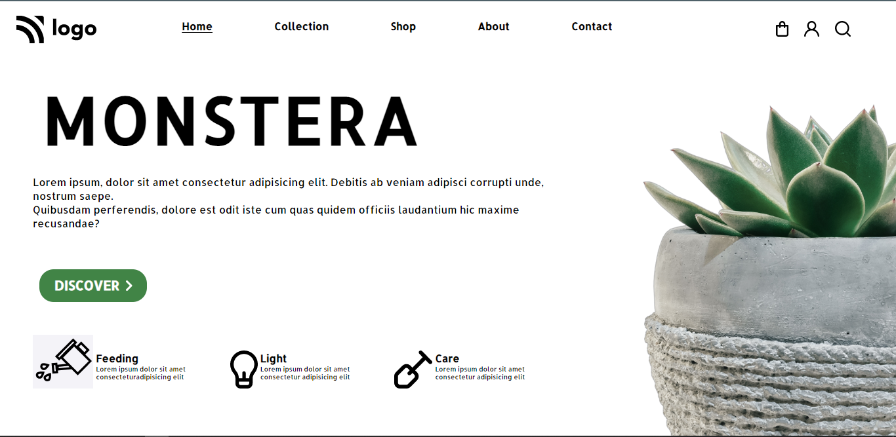
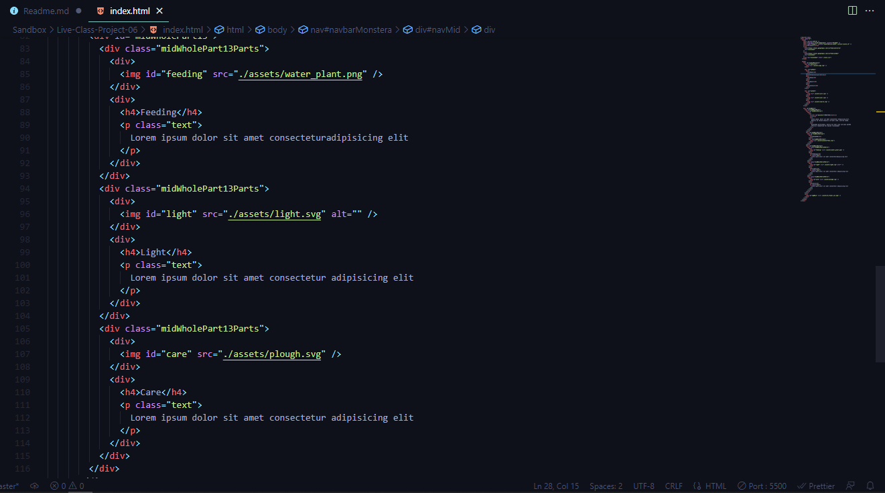
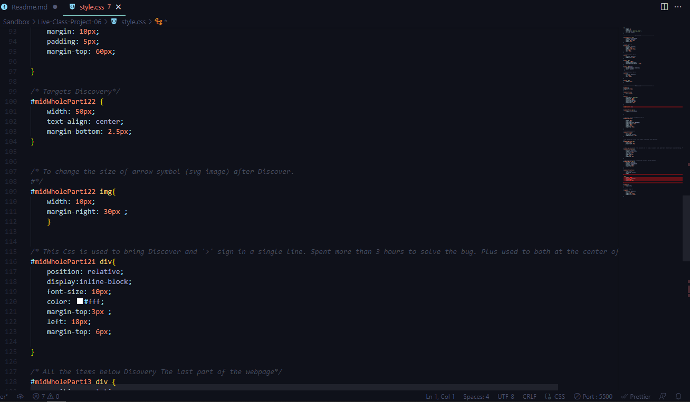

# Fourth Website in pure HTML and CSS

---

### Description 
This is a landing page designed for a design firm in pure HTML and CSS. The overall design is decent, with minimal and simple elements. The overall time it took to complete this project was around `4 hours`. The majority of the time was consumed in finding the right CSS elements for the design. There are multiple elements in this project which require separate attention, such as icon images in the navbar and at the bottom of the page, the discover button with the ' > ' image next to it, the mid section with multiple text formats and font sizes, and many more. This project has taught me the value of CSS selectors. CSS positions and Display properties  on a whole new level.

---

<!-- ABOUT THE PROJECT -->

## About The Project

Here's a Screen-Shot of my first project along with the code snippets.

 

 
<!-- PROJECT LOGO -->
 

  

<h3 align="center">Project 06</h3>

  
   
    <a href="https://harshal-project06.netlify.app/">View Live Demo</a>
  

## Built With

**Using Technologies**

1. `HTML`
2. `CSS`
3. `MarkDown`

> The challenge of this project was to design the page as it is from scratch with pure CSS without using any frameworks.

 

## Live Project

This project is presently deployed in **`Netlify Service`**.

[Live Project URL](https://harshal-project06.netlify.app/)
 

<!-- LEARNT -->
 

## Learnt
In This project I learnt the following properties of HTML and CSS.
- CSS Block and Inline Elements
- In depth of CSS Positions
- CSS Selectors
- Image Manupulation
- Use of third party icons

 
<!-- CONTACT -->

## Contact

- **Name 👨‍💻:** [Harshal Verma](https://github.com/harshalvrm)
- **Email 📧:** [harshalvrm3@gmail.com](mailto:harshalvrm3@gmail.com)
- **Linkedln 📝:** [Linkedin Profile](https://www.linkedin.com/in/harshalvrm3/)
- **Blog 📝:** [Hashnode blog](https://xadai.hashnode.dev/)

 

[Project 6 Link](https://harshal-project06.netlify.app/) 

